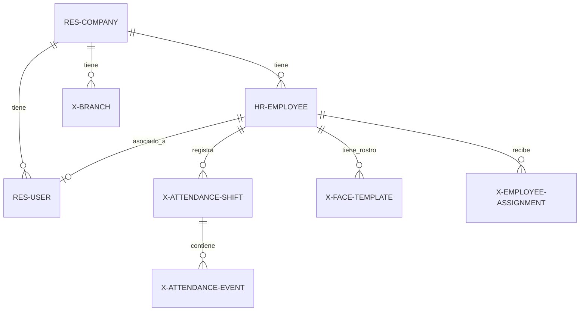
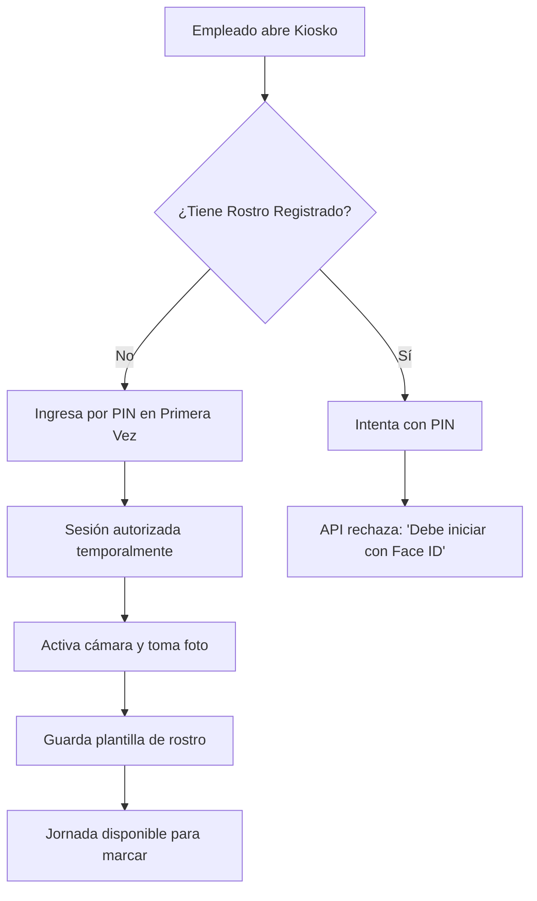

# Manual de Inducción y Desarrollo - Attendance SaaS (Fase 1 a 4)

¡Bienvenido al proyecto! Este manual ha sido redactado para que cualquier persona nueva pueda comprender, configurar, operar y extender el sistema de control de asistencia desde cero.

---

## 1. Visión General del Proyecto

**Attendance SaaS** es un sistema aislado multiempresa diseñado para el control de asistencia de personal en kioskos físicos (celulares, tablets o terminales) y administración web.

### Tecnologías Clave:
* **Backend:** FastAPI (Python), SQLAlchemy ORM, Alembic (migraciones de base de datos) y autenticación JWT.
* **Frontend:** React + Vite + TypeScript, lucide-react para iconos y CSS nativo (sin frameworks como Tailwind) para un control absoluto y limpio del diseño.
* **Base de datos:** MySQL 8.
* **Contenedores:** Docker y Docker Compose para garantizar el aislamiento del entorno.

### Aislamiento de Recursos (WSL / Docker):
Todo el entorno del proyecto se encapsula de forma estricta. Los nombres de recursos declarados en `docker-compose.yml` son:
* **Contenedores:** `attendance_saas_backend`, `attendance_saas_frontend`, `attendance_saas_mysql`
* **Red:** `attendance_saas_network`
* **Volumen:** `attendance_saas_mysql_data`
* **Puertos de Red:** Frontend en `5175`, Backend en `8095`, MySQL en `33075`

> [!CAUTION]
> **No utilices comandos globales de limpieza de Docker** (ej: `docker system prune`, `docker volume prune`, `docker compose down -v`). Esto borraría los datos del volumen persistente y los recursos del proyecto. Para controlar el entorno, usa los comandos provistos en la Sección 3.

---

## 2. Arquitectura de Datos y Modelos

El modelo de datos se apoya en SQLAlchemy y está dividido en tres capas operativas:

### Diagrama de Relaciones Clave:


### Tablas Principales:
1. **Core de Estructura:**
   * `res_company`: Entidad raíz del entorno multiempresa.
   * `x_branch`: Sucursales físicas donde operan los empleados y terminales.
   * `hr_department` / `hr_job`: Organigrama y puestos de trabajo.
2. **Personal y Accesos:**
   * `hr_employee`: Ficha del empleado con su estado actual e información de contacto.
   * `res_users`: Usuarios de inicio de sesión con contraseñas hashificadas, rol administrativo de empresa y PIN de Kiosko.
3. **Control de Asistencia:**
   * `x_device`: Registro autorizado de terminales físicas (Kioskos) por código de dispositivo (`device_code`).
   * `x_attendance_shift`: Jornada laboral del día. Almacena marcas de check-in, check-out, tiempo neto trabajado, descansos (break) e interrupciones (comida).
   * `x_attendance_event`: Cada marca de tiempo individual (entrada, salida a break, regreso, etc.).
   * `hr_attendance`: Registro limpio de asistencias compatible con integraciones de ERP externas (como Odoo).
4. **Reglas y Tareas (Asignaciones):**
   * `x_assignment_template` y `x_assignment_question`: Plantillas de checklists obligatorios y preguntas.
   * `x_employee_assignment`: Tareas generadas a empleados tras marcar check-in o check-out.
   * `x_auto_checkout_rule`: Reglas horarias para el cierre forzoso de jornadas que quedaron abiertas.
5. **Biometría y Logs:**
   * `x_face_template`: Hash de plantillas faciales registradas para el empleado.
   * `x_biometric_log`: Historial de intentos biométricos con porcentaje de confianza.
   * `x_audit_log`: Bitácora inmutable de eventos sensibles del sistema.

---

## 3. Guía de Instalación y Puesta en Marcha

Para iniciar el proyecto por primera vez en tu entorno local (WSL Ubuntu recomendado), ejecuta la siguiente secuencia de comandos:

### Paso 1: Levantar Contenedores
```bash
# Entrar al directorio del proyecto
cd ~/attendance-saas

# Crear archivo de configuración de variables de entorno
cp .env.example .env

# Construir y arrancar servicios en segundo plano
docker compose build
docker compose up -d
```

### Paso 2: Ejecutar Migraciones y Poblar Datos (Seeds)
```bash
# Aplicar migraciones de base de datos a través de Alembic
docker exec -it attendance_saas_backend alembic upgrade head

# Insertar registros y semillas base de demostración
docker exec -it attendance_saas_backend python -m app.seed
```

### Paso 3: Verificar Estado de los Servicios
* **Frontend Web:** http://localhost:5175
* **Backend Healthcheck:** http://localhost:8095/health (debe retornar `{"status":"ok", ...}`)
* **Autodocumentación Swagger:** http://localhost:8095/docs
* **Conexión MySQL local:** `127.0.0.1` en puerto `33075`

### Credenciales de Demostración Iniciales:
* **Usuario Administrador:** `admin` (Contraseña: `[contraseña definida en .env]`) — panel en `/ctrl-ops-7931`
* **Código PIN de Kiosko / gerente:** `7931`
* **Empleado Demo:** `juan_perez` (PIN `5824`, código `EMP-001`)
* **Código de Dispositivo de Prueba:** `KIOSK-DEMO`
* **Empleado Demo:** `Admin Demo` (ID `1`)

---

## 4. Proceso Detallado de Entrada por Face ID (Biometría)

El sistema soporta biometría para identificación en Kioskos mediante un motor de reconocimiento facial simulado (**Provider Mock**) en el backend.

### Flujo de Registro de Rostro por Primera Vez (PIN -> Face ID)
Cuando un empleado no tiene registrado un rostro, no puede iniciar sesión por Face ID. El proceso es:
1. El empleado selecciona en la pantalla inicial de Kiosko: **"🔢 Primera vez del empleado (Ingreso por PIN)"**.
2. Ingresa su PIN personal (ej: `1234`).
3. El frontend llama a `/api/kiosk/identify-pin`. Al detectar que el empleado no cuenta con plantilla facial (`has_face_template = false`), la API autoriza una sesión temporal con un JWT.
4. El frontend redirige automáticamente al flujo de **Registro de Rostro Obligatorio** y enciende la cámara.
5. El empleado se toma una foto (o escribe un identificador mock en el panel de pruebas) y presiona **"Registrar Rostro y Entrar"** (`POST /api/employees/{id}/register-face`).
6. El backend genera la plantilla y, **a partir de ese momento, el empleado queda bloqueado para usar PIN de nuevo**; debe identificarse estrictamente usando Face ID.



### Flujo Técnico del Reconocimiento Facial (Motor Mock)
Cuando el usuario presiona **"Iniciar con Face ID"** (o envía el valor mock `demo-face-admin`), se desencadena el siguiente procesamiento en el backend:

1. **Recepción:** El frontend envía el string base64 o identificador de texto de la imagen al endpoint `POST /api/kiosk/identify-face`.
2. **Generación del Hash:** El backend calcula el hash SHA-256 del texto recibido (`hashlib.sha256(image_base64.encode("utf-8")).hexdigest()`).
3. **Comparación Directa:** Busca en la tabla `x_face_template` de la empresa una coincidencia exacta de hash.
   * **Caso de Coincidencia Exacta:** Identifica al empleado y otorga una confianza de **`0.99`**.
   * **Caso sin Coincidencia (Mock Fallback):** Si no hay coincidencia exacta pero existen plantillas registradas, toma la primera plantilla activa de la base de datos y le asigna una confianza de **`0.82`**.
4. **Verificación de Umbral:** Compara la confianza contra el umbral de la plantilla (`confidence_threshold` por defecto en `0.75`).
   * Como `0.82 >= 0.75`, el sistema autoriza el inicio de sesión del primer empleado, actuando como un simulador exitoso para demostraciones rápidas.
   * Si no hay ninguna plantilla en la BD, la confianza es `0.0` y el acceso se rechaza.
5. **Auditoría y Bitácora:** Se inserta un registro en `x_biometric_log` indicando el éxito/fracaso, IP de origen, dispositivo y porcentaje de coincidencia.

---

## 5. Diseño Responsivo en la Vista Administrativa

La consola de administración (`/ctrl-ops-7931`) ha sido optimizada para adaptarse dinámicamente tanto a pantallas amplias de escritorio como a pantallas móviles o tabletas.

### Grid de Distribución y Grid de Formulario:
* **Distribución Principal (App Shell):** El diseño se basa en un grid de dos columnas en computadoras (`260px` para barra lateral y `1fr` para el área de trabajo principal).
* **Adaptación Mobile:** En anchos de pantalla menores o iguales a `860px`, la barra lateral pasa a un flujo vertical arriba (`position: static`) y la barra de navegación se reorganiza en celdas flexibles con `grid-template-columns: repeat(auto-fit, minmax(130px, 1fr))`.
* **Formularios Dinámicos:** Los campos de edición usan la clase `.grid` con `grid-template-columns: repeat(auto-fit, minmax(190px, 1fr))`, lo que causa que los formularios se acomoden automáticamente de 1, 2 o más columnas según el espacio disponible.
* **Tablas de Datos:** Todas las tablas de consulta están contenidas en un contenedor `.table-wrap` con propiedad `overflow-x: auto` que evita desbordamientos laterales y permite scroll horizontal táctil.

### Adaptabilidad en la Pantalla de Face ID:
* La vista de Face ID del panel administrativo utiliza una rejilla de doble columna flexible:
  ```tsx
  <div style={{ display: 'grid', gridTemplateColumns: 'repeat(auto-fit, minmax(280px, 1fr))', gap: '16px' }}>
  ```
  Esto permite que en teléfonos móviles (anchos < 600px), el formulario de registro de plantilla y el visualizador/capturador de cámara se apilen verticalmente a una sola columna de forma fluida.
* Los botones del panel de acciones de simulación cuentan con la propiedad `flexWrap: 'wrap'` para evitar cortes de texto u overflow visual en pantallas pequeñas.

---

## 6. Ciclo de Pruebas E2E (Guía Rápida para Desarrolladores y QA)

Para verificar que tus cambios no rompan flujos de negocio fundamentales, completa este ciclo de pruebas de 10 puntos:

| # | Prueba | Acción | Resultado Esperado |
| :--- | :--- | :--- | :--- |
| **1** | Login Admin | Entra a `/ctrl-ops-7931` con `admin` / `[contraseña definida en .env]`. | Acceso correcto al Dashboard. |
| **2** | Catálogos | Haz clic en Empresa, Sucursales, Empleados. | Carga de tablas sin errores de API. |
| **3** | Kiosko PIN | Abre Kiosko PIN con `KIOSK-DEMO` y PIN `1234`. | Reconoce a `Admin Demo`. |
| **4** | Registrar Entrada | Haz clic en "Entrada" en Kiosko. | Crea registro de jornada y habilita break/comida. |
| **5** | Asignaciones | Revisa la lista de tareas obligatorias del Kiosko. | Muestra checklist de seguridad generado por regla. |
| **6** | Bloqueo Salida | Intenta marcar "Salida Final" con tareas pendientes. | El backend rechaza la salida por tareas incompletas. |
| **7** | Completar Tareas | Responde preguntas y envía la asignación. | Cambia a estado `completed` o `validated`. |
| **8** | Registrar Salida | Haz clic en "Salida Final" en Kiosko. | Cierra la jornada laboral y calcula horas netas. |
| **9** | Face ID Kiosko | Enciende cámara, usa mock `demo-face-admin` y entra. | Identificación rápida exitosa y token JWT concedido. |
| **10** | Reportes | Entra a "Reportes" en panel admin y recarga. | Tablas de resumen llenas con la actividad previa. |

### Comandos de Diagnóstico Útiles:
Si notas algún comportamiento anómalo o quieres inspeccionar la comunicación, ejecuta:
```bash
# Ver logs del backend en tiempo real
docker compose logs -f backend

# Ver logs del frontend en tiempo real
docker compose logs -f frontend
```
